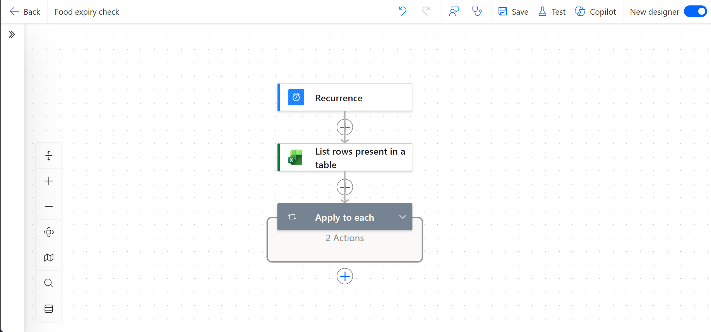
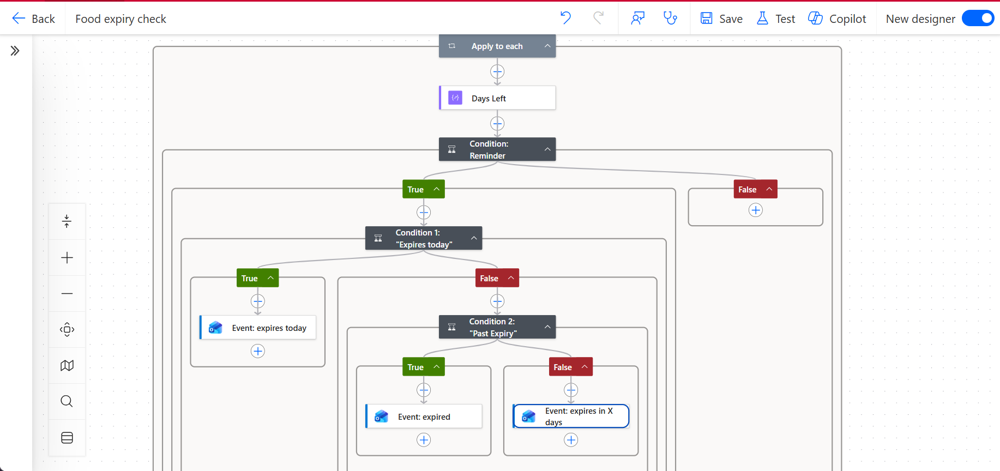

# Food Expiry Reminder
A Power Automate flow that checks a food tracker in Excel every day and puts a reminder on my Outlook calendar when something is about to expire. I built it to stop food spoiling in the fridge, and to learn Power Automate with a problem I actually have.

## How it works
Every day at noon (Pacific), the flow:

1. Reads the `FoodTracker` table in Excel.
2. Loops through each item and works out the days left until its use-by date.
3. Skips anything marked Done, and anything more than 3 days from expiring.
4. Creates a calendar event with one of three messages:
   - **Expires today:** "Yogurt (Unopened) expires today"
   - **Expired:** "Cottage cheese (Unopened) expired 3 days ago, check it or toss it"
   - **Expires soon:** "Milk (Opened) expires in 1 day"

The event starts 5 minutes after the flow runs and has a reminder at 0 minutes, so my phone buzzes.

## The Excel tracker
Each item has a status (Unopened, Opened or Done). The use-by date is the printed date for unopened food. For opened food, it's whichever comes first: the printed date, or the date opened plus the days it stays good once opened. Those days come from a `Shelf life` sheet, using Health Canada numbers where I could find them.

**What the reminder looks like on my iPad:**

## Limitations

- **Repeat reminders:** the flow runs daily, so an item keeps getting reminders until I mark it Done.
- **Shelf-life numbers are general guidelines.** The package label always wins. Health Canada covers dairy, eggs and leftovers. Produce numbers come from Love Food Hate Waste Canada, a non-government source.
- **Calendar instead of push notifications:** I first tried using Power Automate's mobile notification, but Microsoft retired the mobile app in August 2026. I switched to Outlook calendar reminders.

## Tools
Power Automate (cloud flow), Excel Online, Outlook Calendar

